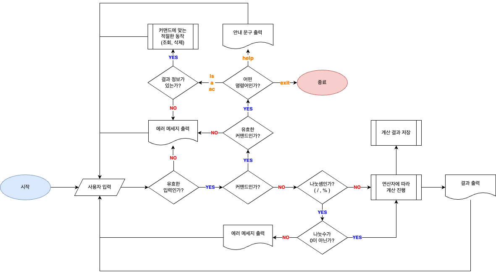

<br/>

## 🔗 목차
1. [🧮 프로젝트 소개](#-프로젝트-소개)
2. [🕰️ 개발 기간](#%EF%B8%8F-개발-기간)
3. [📚 개발 환경](#-개발-환경)
4. [🌳 디렉토리 구조](#-디렉토리-구조)
5. [👨🏻‍💻 개발 과정](#-개발-과정)
6. [🛠️ 주요 기능](#%EF%B8%8F-주요-기능)

   6-1. [프로그램 초기 화면](#-프로그램-초기-화면-)

   6-2. [도움말 출력](#-도움말-출력-)

   6-3. [계산 기능](#-계산-기능-)

   6-4. [명령어](#-명령어-)
7. [📝 프로젝트 명세](#-프로젝트-명세)

   7-1. [클래스 다이어그램 UML](#클래스-다이어그램-uml)

   7-2. [Flowchart](#flowchart)
8. [💭 마무리](#-마무리)

<br/>

## 🧮 프로젝트 소개
1️⃣ 클래스 없이 기본적인 연산을 수행할 수 있는 계산기 만들기
<br/>
2️⃣ 클래스를 적용해 기본적인 연산을 수행할 수 있는 계산기 만들기
<br/>
3️⃣ Enum, 제네릭, 람다 & 스트림을 이해한 계산기 만들기

위 3단계에 걸쳐서 계산기 프로젝트를 발전시켜 나갑니다.

각 단계는 커밋 히스토리에서 확인할 수 있습니다.

<br/>

## 🕰️ 개발 기간
- 2025.02.25 ~ 2025.03.05 (총 9일)

<br/>

## 📚 개발 환경

### Environment
[](https://skillicons.dev)
### Develop
[](https://skillicons.dev)


### SCM
[](https://skillicons.dev)

<br/>

## 🌳 디렉토리 구조
```java
JavaCalculator/
├── src/
│   ├── main/com/Sparta/Calculator/
│   │   ├── App/
│   │   │   ├── Calculator.java
│   │   │   └── Main.java
│   │   ├── Operations/
│   │   │   ├── Computable.java
│   │   │   ├── MathOperator.java
│   │   │   └── Operators.java
│   │   └── Utils/
│   │       ├── Converter.java
│   │       ├── InputParser.java
│   │       ├── Menu.java
│   │       └── ResultManager.java
│   └── test/com/Sparta/Calculator/
│       ├── App/
│       ├── Operations/
│       └── Utils/
├── docs/
│   ├── images/
│   │   ├── flowchart-detail.png
│   │   ├── flowchart-simple.png
│   │   └── UML.png
│   └── xml/
│       ├── flowchart-detail
│       ├── flowchart-simple
│       └── UML
└── README.md
```

<br/>

## 👨🏻‍💻 개발 과정

### 1️⃣ 절차적 프로그래밍 기반의 CLI 계산기
- 무한 반복문을 사용하여 사용자가 `exit` 을 입력하기 전까지 계산을 수행합니다.
- 하나의 파일에서 모든 작업이 순차적으로 이루어집니다.

### 2️⃣ 객체지향적 설계를 적용한 계산기
- 1️⃣ 에서 작성한 코드를 기반으로 모듈화, 클래스화를 진행합니다.
- 클래스와 객체를 활용하여 구조화된 코드를 작성합니다.
- 컬렉션을 활용하여 데이터를 저장합니다.
- 데이터 보호를 위해 캡슐화를 적용합니다.
- 연산 기능을 효율적으로 관리할 수 있도록 개선합니다.

### 3️⃣ 제네릭과 함수형 프로그래밍 개념을 접목한 계산기
- 2️⃣ 에서 작성한 코드를 기반으로 고급 기능을 적용합니다.
- `Enum` 을 활용하여 연산자 타입을 관리합니다.
- 람다 표현식을 사용하여 코드 가독성과 유지보수성을 향상합니다.

### 자세한 개발 과정은 아래 블로그를 참조해주세요.

<a href="https://velog.io/@pottq577/TIL-23%EC%9D%BC%EC%B0%A8-%EA%B3%84%EC%82%B0%EA%B8%B0-%EA%B3%BC%EC%A0%9C-day-1"></a>

<a href="https://velog.io/@pottq577/TIL-24%EC%9D%BC%EC%B0%A8-%EA%B3%84%EC%82%B0%EA%B8%B0-%EA%B3%BC%EC%A0%9C-day-2"></a>

<a href="https://velog.io/@pottq577/TIL-25%EC%9D%BC%EC%B0%A8-%EA%B3%84%EC%82%B0%EA%B8%B0-%EA%B3%BC%EC%A0%9C-day-3"></a>

<a href="https://velog.io/@pottq577/TIL-26%EC%9D%BC%EC%B0%A8-%EA%B3%84%EC%82%B0%EA%B8%B0-%EA%B3%BC%EC%A0%9C-day-4"></a>

<a href="https://velog.io/@pottq577/TIL-26%EC%9D%BC%EC%B0%A8-%EA%B3%84%EC%82%B0%EA%B8%B0-%EA%B3%BC%EC%A0%9C-day-5"></a>

<a href="https://velog.io/@pottq577/TIL-27%EC%9D%BC%EC%B0%A8-%EA%B3%84%EC%82%B0%EA%B8%B0-%EA%B3%BC%EC%A0%9C-day-6"></a>


<br/>

## 🛠️ 주요 기능
### [ 프로그램 초기 화면 ]
- 사용자가 프로그램을 실행하면 보여지는 화면입니다.

```java
'help' 입력 시 안내 문구가 출력됩니다.

수식 입력: 
```

<br/>

### [ 도움말 출력 ]

- 사용자가 `help` 를 입력하면 수식 입력 예시, 지원하는 연산자와 사용할 수 있는 명령어를 출력합니다.

```java
수식 입력: help

==============================
사용 방법            
==============================
입력 예  - 1+2, 3-1, 4*2, 8/4
연산자   - +, -, *, /, %, ^
==============================

==============================
명령어             
==============================
exit  - 프로그램 종료
ls    - 저장된 결과 출력
a     - 가장 먼저 저장된 결과 삭제
ac    - 모든 결과 삭제
==============================

```

<br/>

### [ 계산 기능 ]

- 사용자는 `1+1` , `1 + 1`와 같이 띄어쓰기 구분 없이 한 줄로 수식을 입력할 수 있습니다.

```java
수식 입력: 1+1
2.0

=============================
// 띄어쓰기 구분 없이 수식 입력 가능
수식 입력: 2 - 1 
1.0

=============================

수식 입력: 4*2
8.0

=============================

...
```

- 사용자가 `/` , `%` 연산을 진행할 때 <u>나눗수가 0일 경우</u> 예외 처리를 통해 에러 메세지를 출력합니다.
- 사용자가 예상치 못한 입력을 했을 때 상황에 맞는 적절한 에러 메세지를 출력합니다.
- 에러 메세지가 출력된 후, 사용자는 계속해서 계산기 사용이 가능합니다.

```java
수식 입력: 5/0
수학적 오류: 0으로 나눌 수 없습니다.

'help'를 입력하여 입력 형식을 확인해주세요.

=============================

수식 입력: 5%0
수학적 오류: 0으로 나눌 수 없습니다.

'help'를 입력하여 입력 형식을 확인해주세요.

=============================

수식 입력: 5u5
계산 오류: 지원하지 않는 연산자입니다: u

'help'를 입력하여 입력 형식을 확인해주세요.

=============================

수식 입력: foobar
입력 오류 발생: For input string: "f"
계산 오류: 연산자가 설정되지 않았습니다.

'help'를 입력하여 입력 형식을 확인해주세요.

=============================

수식 입력: 
입력 오류 발생: 입력값이 비어있습니다.
계산 오류: 연산자가 설정되지 않았습니다.

'help'를 입력하여 입력 형식을 확인해주세요.

=============================

수식 입력: 1+

입력 오류 발생: 올바르지 않은 수식 형식입니다. (예: 2 + 3)
계산 오류: 연산자가 설정되지 않았습니다.

'help'를 입력하여 입력 형식을 확인해주세요.

=============================
```

<br/>

### [ 명령어 ]

**1. 연산 결과 보기**
- 사용자가 `ls` 를 입력하면  현재까지 계산한 결과 목록을 보여줍니다.

```java
수식 입력: ls

저장된 결과: [2.0, 1.0, 8.0, 2.0, 16.0, 2.0]
```

- 저장된 결과가 없을 경우 안내 문구를 출력합니다.
```java
수식 입력: ls

저장된 계산 결과가 없습니다.
```


**2. 연산 결과 삭제**

- 사용자가 `a` 를 입력하면 가장 먼저 계산된 결과가 삭제됩니다.

```java
수식 입력: a

2.0 이 삭제되었습니다.
```

- `ls` 를 입력해서 삭제된 결과를 확인할 수 있습니다.

```java
수식 입력: ls

저장된 결과: [1.0, 8.0, 2.0, 16.0, 2.0]
```

- 저장된 결과가 없을 경우 안내 문구를 출력합니다.

```java
수식 입력: a

저장된 계산 결과가 없습니다.
```

**3. 연산 결과 모두 삭제**

- 사용자가 `ac` 를 입력하면 저장된 모든 결과가 삭제됩니다.

```java
수식 입력: ac

모든 결과가 삭제되었습니다.
```

- `ls` 를 입력해서 삭제된 결과를 확인할 수 있습니다.

```java
수식 입력: ls

저장된 계산 결과가 없습니다.
```

- 저장된 결과가 없을 경우 안내 문구를 출력합니다.

```java
수식 입력: ac

저장된 계산 결과가 없습니다.
```

**4. 프로그램 종료**

- 사용자가 `exit` 을 입력하면 프로그램이 종료됩니다.

```java
수식 입력: exit

프로그램을 종료합니다.
```

<br/>

## 📝 프로젝트 명세
###  클래스 다이어그램 UML


### Flowchart
- [ 간단한 순서도 ]


<details>
  <summary>[ 자세한 순서도 ] </summary>
  <br>
  
</details>


<br/>

## 💭 마무리

### 느낀 점
- 설계가 가장 중요하다고 생각된다.
- 설계 없이 닥치는대로 기능을 넣다보니 나중에 유지보수하기 힘들었다.
- AI를 사용하지 않고 직접 검색하고 찾아보며 코드를 작성하는 게 학습에는 훨씬 효율적이라고 느껴졌다.


### 아쉬운 점
- `제네릭` 을 활용해서  숫자 타입을 다양하게 사용할 수 있었으면 좋았을 것 같다.
  - 사용자가 원하는 숫자 타입을 입력하면 해당 타입으로 연산하는 계산기가 만들어졌다면 조금 더 좋은 계산기 프로젝트가 되었을 것 같다.
- `commit 컨벤션` 을 작성하지 않았다.
  - 컨벤션을 지키면 히스토리가 정확히 보여서 코드 검토할 때 편했을 것이다.
- `브랜치 전략` 을 이용하지 않았다.
  - 서브 브랜치를 만들지 않고, 메인 브랜치에 모든 작업 내용을 올렸다.
  - 프로젝트가 커질 수록 브랜치 전략을 잘 활용해야 한다고 생각한다.
- `README.md` 를 처음부터 작성하지 않았다.
  - 다 만들어진 후 README를 작성하다 보니 변경 내역과 같은 요소가 들어가지 못해 아쉬웠다.
- `Github Issues 페이지` 를 활용하지 않았다.
  - 개발을 진행하면서 오류가 발생했거나, 내 의도대로 되지 않던 내용을 기록해뒀으면 나중에 디버깅할때도 편해질 것 같다.
- 설계 없이 만든 프로젝트이기 때문에 구조화가 덜 되어있다고 생각한다.

<br/>

## 🙋🏻‍♂️ 정보

[](https://velog.io/@pottq577)
